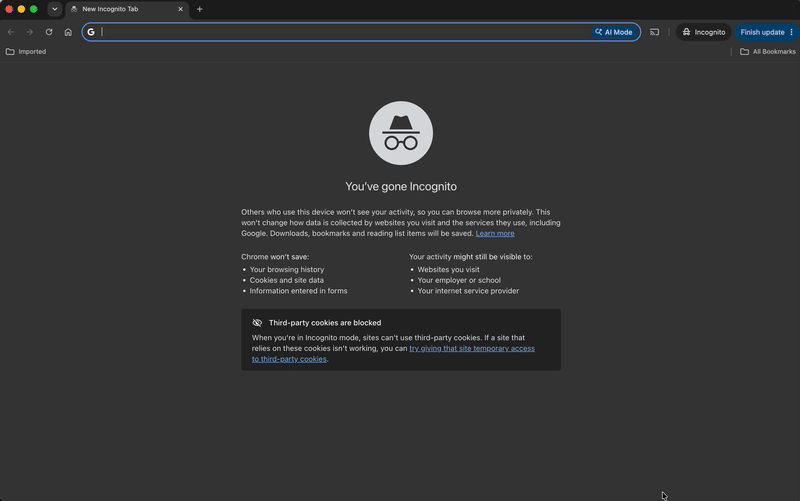

# Video Knowledge Panel

A Chrome extension that turns any YouTube video into an interactive knowledge base. Get an AI-generated summary, explore key topics, and chat with the content — all in a side panel without leaving the page.

---

## What it does

### Summary tab

When you open a YouTube video, the extension automatically analyzes the transcript and surfaces:

- **Summary** — a concise overview of what the video covers
- **Key Topics** — the main concepts discussed, with timestamps to jump directly to that point in the video
- **Step-by-step breakdown** — actionable steps extracted from tutorial or how-to content
- **References** — tools, libraries, people, and resources mentioned

```
┌──────────────────────────────────┐
│  Video Knowledge Panel      ⚙️   │
│  ┌──────────┬───────────────┐    │
│  │ Summary  │     Chat      │    │
│  └──────────┴───────────────┘    │
│                                  │
│  📋 Summary                      │
│  ─────────────────────────────   │
│  This video covers building a    │
│  React app with TypeScript…      │
│                                  │
│  🏷️ Topics                       │
│  ─────────────────────────────   │
│  • Component Architecture  0:45  │
│  • State Management        3:12  │
│  • TypeScript Generics     8:30  │
│                                  │
│  📌 Steps                        │
│  ─────────────────────────────   │
│  1. Install dependencies         │
│  2. Set up project structure     │
│  3. Create base components       │
│                                  │
│  🔗 References                   │
│  ─────────────────────────────   │
│  • React Docs  →                 │
│  • TypeScript  →                 │
└──────────────────────────────────┘
```

### Chat tab

Ask questions, generate content, and explore ideas — all grounded in the video's transcript.

**Ask questions about the video**
Type any question and receive a streamed answer based on the transcript. The AI maintains full conversation context across turns so you can ask follow-ups naturally.

**Generate a blog post**
Click "Generate Blog Post" to produce a publication-ready, markdown-formatted article: title, introduction, structured sections, and conclusion — derived from the video content.

**Dive deeper into any topic**
After any assistant response, a "Dive Deeper" chip appears. Click it to pre-fill the input with a follow-up prompt, making it easy to explore topics the video only briefly touched on.

```
┌──────────────────────────────────┐
│  Video Knowledge Panel      ⚙️   │
│  ┌──────────┬───────────────┐    │
│  │ Summary  │  Chat  ←      │    │
│  └──────────┴───────────────┘    │
│                                  │
│  ┌────────────────────────────┐  │
│  │ 👤 What does this video    │  │
│  │    cover about hooks?      │  │
│  └────────────────────────────┘  │
│                                  │
│  The video covers three hook     │
│  patterns: useState for local    │
│  state, useEffect for side       │
│  effects, and custom hooks for   │
│  reusable logic…           ▌     │
│                                  │
│  [ Dive Deeper ]                 │
│                                  │
│  ┌─────────────────────────────┐ │
│  │ 📝 Generate Blog Post       │ │
│  └─────────────────────────────┘ │
│  ┌─────────────────────────────┐ │
│  │ Ask a question…        Send │ │
│  └─────────────────────────────┘ │
└──────────────────────────────────┘
```

---

## How it works

```
YouTube page                Extension                  Azure backend
─────────────               ─────────────              ──────────────
Video loads        ──►  Content script extracts    ──►  /api/analyze
                        transcript + metadata           │
                             │                          │  Azure OpenAI
                             │                          │  gpt-4o-mini
                        Background service  ◄──────────┘
                        caches result in
                        chrome.storage.session
                             │
                        Side panel renders
                        Summary tab
                             │
User opens Chat    ──►  ChatPanel loads session
User asks question ──►  /api/chat (SSE stream)  ──►  /api/chat
                             │                          │
                        Streams deltas  ◄──────────────┘  Azure OpenAI
                        renders live                       streaming
```

- The extension runs entirely client-side except for the two Azure Function calls
- Chat history and video data are stored in `chrome.storage.session` (cleared when the browser closes)
- Responses stream token-by-token via Server-Sent Events so you see output as it's generated
- Transcripts are capped at 80,000 characters before being sent to the API

---

## Getting started

### Prerequisites

- Node.js 20+
- [Azure Functions Core Tools v4](https://learn.microsoft.com/en-us/azure/azure-functions/functions-run-local)
- An [Azure OpenAI](https://azure.microsoft.com/en-us/products/ai-services/openai-service) resource with a `gpt-4o-mini` (or equivalent) deployment

---

### 1. Clone and install

```sh
git clone <repo-url>
cd ytsummary

# Install extension dependencies
cd extension && npm install && cd ..

# Install functions dependencies
cd functions && npm install && cd ..
```

---

### 2. Configure the Azure Function

Create `functions/local.settings.json`:

```json
{
  "IsEncrypted": false,
  "Values": {
    "AzureWebJobsStorage": "UseDevelopmentStorage=true",
    "FUNCTIONS_WORKER_RUNTIME": "node",
    "AZURE_OPENAI_ENDPOINT": "https://<your-resource>.openai.azure.com",
    "AZURE_OPENAI_API_KEY": "<your-api-key>",
    "AZURE_OPENAI_DEPLOYMENT": "gpt-4o-mini",
    "GOOGLE_OAUTH_CLIENT_ID": "<your-google-oauth-client-id>"
  },
  "Host": {
    "CORS": "*"
  }
}
```

`AzureWebJobsStorage` also backs two new Table Storage tables used for sign-in and saved history — `AllowedUsers` and `SavedVideos` — created automatically on first use against the same storage account (or Azurite locally, no separate setup needed). `GOOGLE_OAUTH_CLIENT_ID` is the OAuth 2.0 Client ID from Google Cloud Console (see step 3) — the backend verifies every request's ID token was issued for this audience.

Start the function locally:

```sh
cd functions
npm run build
func start
# Functions running at http://localhost:7071
```

---

### 3. Configure the extension

In [Google Cloud Console](https://console.cloud.google.com/apis/credentials), create an OAuth 2.0 Client ID (type: Web application) and add the extension's `chrome.identity.getRedirectURL()` value (`https://<extension-id>.chromiumapp.org/`) as an authorized redirect URI. Use the resulting client ID as both `WXT_GOOGLE_OAUTH_CLIENT_ID` below and `GOOGLE_OAUTH_CLIENT_ID` above.

Create `extension/.env.local`:

```sh
WXT_AZURE_FUNCTION_URL=http://localhost:7071/api/analyze
WXT_AZURE_FUNCTION_KEY=
WXT_GOOGLE_OAUTH_CLIENT_ID=<your-google-oauth-client-id>
```

For a deployed Azure Function App, replace the URL with your function app URL and set the function key.

Then authorize at least your own account to sign in (no one can use the extension until they're on this list):

```sh
cd functions
npm run allowed-users -- add you@example.com
```

---

### 4. Build and load the extension

```sh
cd extension
npm run dev   # development mode with hot reload
# or
npm run build # production build → .output/chrome-mv3/
```

In Chrome:
1. Go to `chrome://extensions`
2. Enable **Developer mode** (top right)
3. Click **Load unpacked**
4. Select the `.output/chrome-mv3/` folder



---

### 5. Use it

1. Navigate to any YouTube video
2. Click the extension icon in the Chrome toolbar to open the side panel
3. Wait a few seconds for the summary to generate
4. Switch to the **Chat** tab to ask questions or generate a blog post


---

## Release Process

To publish a new versioned release of the extension:

1. **Bump the version** in [extension/package.json](extension/package.json):
   ```json
   { "version": "0.1.0" }
   ```

2. **Commit and push** the version bump (directly or via PR to `main`):
   ```sh
   git add extension/package.json
   git commit -m "chore: bump version to 0.1.0"
   git push origin main
   ```

3. **Create and push a matching version tag**:
   ```sh
   git tag v0.1.0
   git push origin v0.1.0
   ```

4. **The `Release` workflow fires automatically** on tag push and:
   - Validates that the tag version matches `extension/package.json`
   - Rejects duplicate releases (same tag cannot be released twice)
   - Runs lint, unit tests, and build as a CI gate
   - Packages the extension as a `ytsummary-v0.1.0.zip` archive
   - Creates a GitHub Release tagged `v0.1.0` in the **private** [kippolitov/ytsummary-releases](https://github.com/kippolitov/ytsummary-releases) repository, with the archive as the sole downloadable asset

The build has the Azure Function URL and key baked in, so distribution is access-controlled: only collaborators on the private `ytsummary-releases` repository can download release assets. Share builds with others by downloading the zip yourself and sending it out-of-band.

---

## CI/CD Pipelines

GitHub Actions workflows run automatically on every push:

| Trigger | What runs |
|---|---|
| Push to any branch (except `main`) | Lint + unit tests + build for both `extension/` and `functions/` (parallel) |
| Push to `main` (PR merge) | Same CI checks, then deploys the Functions app to Azure and triggers a versioned release |
| Push of `v*.*.*` tag | Version validation, CI gate, archive build, GitHub Release creation in `kippolitov/ytsummary-releases` |

### Required GitHub Secrets

Before the CD pipeline can succeed, configure these secrets in **Settings → Secrets and variables → Actions**:

| Secret | Description |
|---|---|
| `AZURE_CLIENT_ID` | Azure app registration client ID (for OIDC login) |
| `AZURE_TENANT_ID` | Azure tenant ID (for OIDC login) |
| `AZURE_SUBSCRIPTION_ID` | Azure subscription ID (for OIDC login) |
| `AZURE_FUNCTIONAPP_NAME` | Name of the Azure Function App to deploy to |
| `GH_PAT` | Fine-grained Personal Access Token with **Contents → Read and write** and **Actions → Read and write** for this repository (used by the CD pipeline to push version-bump commits/tags and trigger the release workflow) |
| `RELEASES_REPO_TOKEN` | Fine-grained Personal Access Token with **Contents → Read and write** for the private `kippolitov/ytsummary-releases` repository (used by the release workflow to create releases there) |

See [specs/003-cicd-pipelines/quickstart.md](specs/003-cicd-pipelines/quickstart.md) for validation scenarios and setup instructions.

---

## Deploying to Azure

The CD pipeline deploys automatically on every merge to `main` using OIDC federated identity — no publish profile or long-lived credentials are stored.

To deploy manually, build and package the functions:

```sh
cd functions
npm run build:production   # compiles TypeScript and creates func-deploy.zip
```

Then deploy via Azure CLI or the Azure Portal. Set these application settings on the Function App:

| Setting | Value |
|---|---|
| `AZURE_OPENAI_ENDPOINT` | Your Azure OpenAI endpoint URL |
| `AZURE_OPENAI_API_KEY` | Your API key |
| `AZURE_OPENAI_DEPLOYMENT` | Deployment name (e.g. `gpt-4o-mini`) |
| `GOOGLE_OAUTH_CLIENT_ID` | The Google OAuth 2.0 Client ID from step 3 of setup |

`AllowedUsers` and `SavedVideos` reuse the Function App's existing storage account (`AzureWebJobsStorage`) — no new resource to provision.

Then update `extension/.env.local` to point at your deployed URL:

```sh
WXT_AZURE_FUNCTION_URL=https://<your-app>.azurewebsites.net/api/analyze
WXT_AZURE_FUNCTION_KEY=<your-function-key>
WXT_GOOGLE_OAUTH_CLIENT_ID=<your-google-oauth-client-id>
```

Rebuild the extension (`npm run build`) and reload it in Chrome.

---

## Project structure

```
ytsummary/
├── .github/
│   └── workflows/
│       ├── ci.yml              # Feature branch CI: lint + test + build
│       ├── cd.yml              # Main branch CD: CI + package extension + deploy functions
│       └── release.yml         # Tag-triggered release: version validation + GitHub Release
│
├── extension/                  # Chrome extension (WXT + React + Tailwind)
│   ├── components/
│   │   ├── Chat/               # Chat tab UI (ChatPanel, ChatInput, bubbles)
│   │   ├── KnowledgePanel/     # Summary tab container
│   │   └── sections/           # Summary, Topics, Steps, References
│   ├── entrypoints/
│   │   ├── background.ts       # Service worker — orchestrates analysis
│   │   ├── content.ts          # Detects video navigation
│   │   ├── captionExtractor.content.ts  # Pulls transcript from the page
│   │   └── sidepanel/          # React app rendered in the side panel
│   ├── services/
│   │   ├── chatCache.ts        # Persists chat history in session storage
│   │   ├── chatClient.ts       # SSE streaming client for /api/chat
│   │   └── sessionCache.ts     # Caches analysis results and video data
│   └── types/                  # Shared TypeScript interfaces
│
└── functions/                  # Azure Functions v4 Node.js backend
    └── src/
        ├── analyze/index.ts    # POST /api/analyze — video analysis
        ├── chat/index.ts       # POST /api/chat — streaming chat + blog post
        └── services/
            ├── chatOrchestrator.ts    # Builds prompts, streams OpenAI responses
            └── openaiOrchestrator.ts  # Structured analysis via Azure OpenAI
```

---
## Code Coverage badge

[](https://codecov.io/github/kippolitov/ytsummary)
___

## Tech stack

| Layer | Technology |
|---|---|
| Extension framework | [WXT](https://wxt.dev/) (Web Extension Toolkit) |
| UI | React 18, Tailwind CSS |
| Language | TypeScript 5 |
| Backend | Azure Functions v4, Node.js 20 |
| AI | Azure OpenAI (gpt-4o-mini) |
| Streaming | Server-Sent Events over chunked HTTP |
| Storage | `chrome.storage.session` |
| Testing | Vitest, msw |
