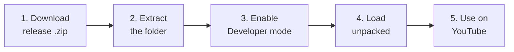

# Video Knowledge Panel — Releases

This repo hosts ready-to-install builds of **Video Knowledge Panel**, a Chrome extension
that shows a structured AI knowledge panel alongside YouTube videos, with an AI chat in
the browser side panel.

The extension is not on the Chrome Web Store, so it is installed manually ("unpacked").
The whole process takes about 2 minutes:



---

## 1. Download the release zip

1. Open the [**Releases** page](../../releases) of this repo.
2. Find the latest release (the one at the top, e.g. `v0.0.29`).
3. Under **Assets**, click the `ytsummary-vX.Y.Z.zip` file to download it.

```text
┌─────────────────────────────────────────────────────────┐
│  Releases                                               │
│                                                         │
│  ● v0.0.29                                   [Latest]   │
│    Built from ytsummary@1356b9c                         │
│                                                         │
│    ▾ Assets (3)                                         │
│      📦 ytsummary-v0.0.29.zip   ←── click to download   │
│      📄 Source code (zip)                               │
│      📄 Source code (tar.gz)                            │
└─────────────────────────────────────────────────────────┘
```

> ⚠️ Download the `ytsummary-vX.Y.Z.zip` asset — **not** "Source code".
> The source archives do not contain a built extension.

## 2. Extract the extension

1. Open your `Downloads` folder and find `ytsummary-vX.Y.Z.zip`.
2. Right-click it → **Extract All…** (Windows) or double-click it (macOS).
3. You get a folder named `chrome-mv3-vX.Y.Z`. Inside it there is a `manifest.json`
   file — that's how you know it's the right folder.

```text
Downloads/
└── ytsummary-v0.0.29.zip
    └── chrome-mv3-v0.0.29/        ←── this is the folder you will load in Chrome
        ├── manifest.json          ←── must be at the top level of the folder
        ├── background.js
        ├── sidepanel.html
        └── ...
```

> 💡 Move the extracted folder somewhere permanent (e.g. `Documents\extensions\`).
> Chrome loads the extension **from this folder** — if you delete or move it later,
> the extension stops working.

## 3. Enable Developer mode in Chrome

1. In Chrome, open a new tab and go to: `chrome://extensions`
   (or **⋮ menu → Extensions → Manage Extensions**).
2. In the **top-right corner**, switch on the **Developer mode** toggle.

```text
┌──────────────────────────────────────────────────────────────┐
│ chrome://extensions                                          │
├──────────────────────────────────────────────────────────────┤
│  ☰ Extensions                          Developer mode  [✔ ●] │ ←── turn ON
│                                                              │
│  ┌─────────────┐ ┌─────────────┐ ┌──────────────┐            │
│  │ Load        │ │ Pack        │ │ Update       │            │ ←── new buttons
│  │ unpacked    │ │ extension   │ │              │            │     appear
│  └─────────────┘ └─────────────┘ └──────────────┘            │
└──────────────────────────────────────────────────────────────┘
```

When the toggle is on, three new buttons appear at the top-left, including **Load unpacked**.

## 4. Install the extension

1. Click **Load unpacked**.
2. In the file picker, select the extracted `chrome-mv3-vX.Y.Z` folder
   (the folder that **directly contains** `manifest.json`) and confirm.
3. The extension card appears in the list:

```text
┌──────────────────────────────────────────────┐
│  🧩 Video Knowledge Panel          0.0.29    │
│  Displays a structured knowledge panel       │
│  alongside YouTube videos                    │
│                                              │
│  Details    Remove                  [✔ ●] ON │
└──────────────────────────────────────────────┘
```

4. (Recommended) Pin it to the toolbar: click the puzzle-piece icon 🧩 next to the
   address bar, then click the 📌 pin next to **Video Knowledge Panel**.

> ❗ If you get *"Manifest file is missing or unreadable"*, you selected the wrong
> folder — pick the folder that contains `manifest.json` directly, not its parent
> and not the `.zip` file.

## 5. Use it

1. Go to [youtube.com](https://www.youtube.com) and open any video **that has captions**.
2. The knowledge panel appears alongside the video with a structured summary.
3. Click the **Video Knowledge Panel** icon in the toolbar to open the **AI chat side
   panel** and ask questions about the video.

```text
┌────────────────────────────────────────────────┬───────────────────┐
│ YouTube                              🧩 ←click │  AI Chat          │
├───────────────────────────────┬────────────────┤                   │
│                               │ Knowledge      │  You: What are    │
│        ▶ Video player         │ Panel          │  the key points?  │
│                               │                │                   │
│                               │ • Summary      │  AI: The video    │
│                               │ • Key points   │  covers...        │
│                               │ • Topics       │                   │
└───────────────────────────────┴────────────────┴───────────────────┘
```

---

## Updating to a new version

1. Download and extract the new release zip (steps 1–2).
2. Go to `chrome://extensions`, click **Remove** on the old version.
3. Click **Load unpacked** and select the new `chrome-mv3-vX.Y.Z` folder.

## Troubleshooting

| Problem | Fix |
| --- | --- |
| "Manifest file is missing or unreadable" | Select the folder that directly contains `manifest.json`, not the zip or a parent folder. |
| No panel appears on a video | The video needs captions — try a video with captions enabled. |
| Extension disappeared after a restart | The extracted folder was moved or deleted. Re-extract and **Load unpacked** again. |
| Chrome shows "Developer mode extensions" warning on startup | Expected for unpacked extensions — click ✕ to dismiss. |
